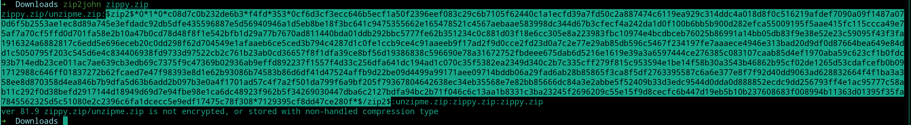
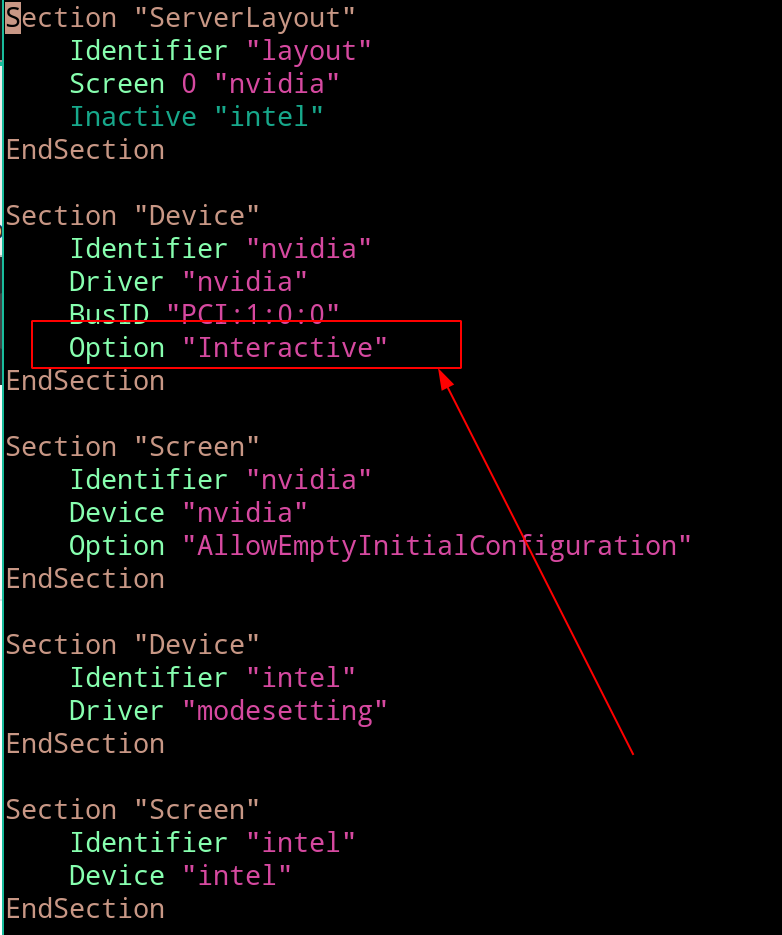

# ZIP

#### 需要的工具:

- john
- hashcat 

[例题文件](https://github.com/SMU-CAA/CTF-guide/blob/master/Password%20Cracking/files/zippy.zip)

#### 做法:

1. 提取hash指纹

   ```bash
   zip2john zippy.zip
   ```



中间这一段是我们需要的hash指纹;指纹前后的字符串显示的是这个压缩包受保护的压缩文件

 2.将指纹保存为zip.hash文件

 3.用hashcat爆破

```bash
hashcat -a 0 -m 13600 zip.hash rockyou.txt
```

参数解释：

-a 0 表示使用标准模式攻击: 单纯的使用字典

-m 13600 表示使用13600号hash模式 (使用hashcat -h查看完整列表)

rockyou.txt 为字典文件

攻击完成后不会理解显示密码！ 使用以下命令查看

```bash
hashcat -a 0 -m 13600 zip.hash rockyou.txt --show
```


另外注意 `/etc/X11/xorg.conf` 中显卡配置记得加上这个 打开hashcat与内核交互

